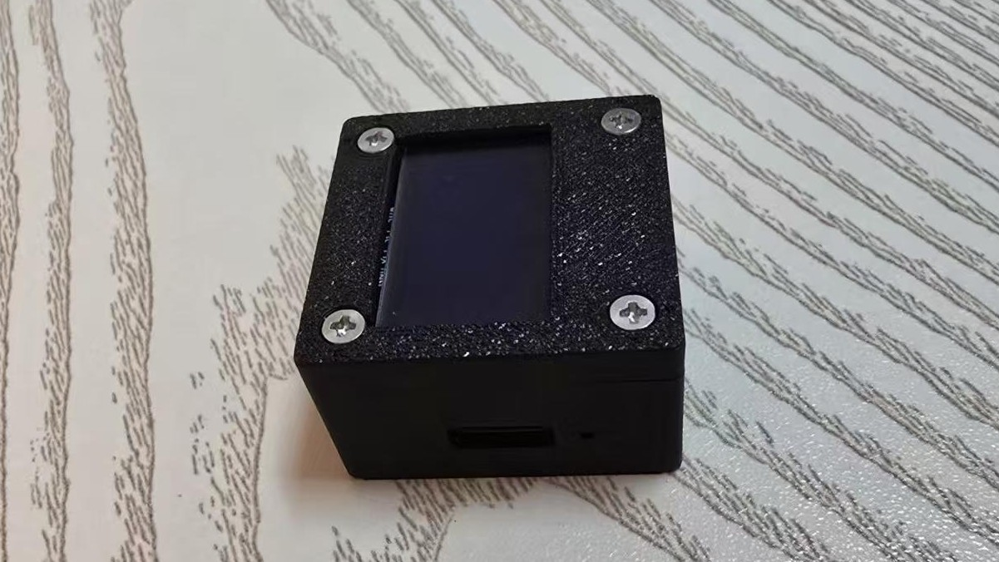
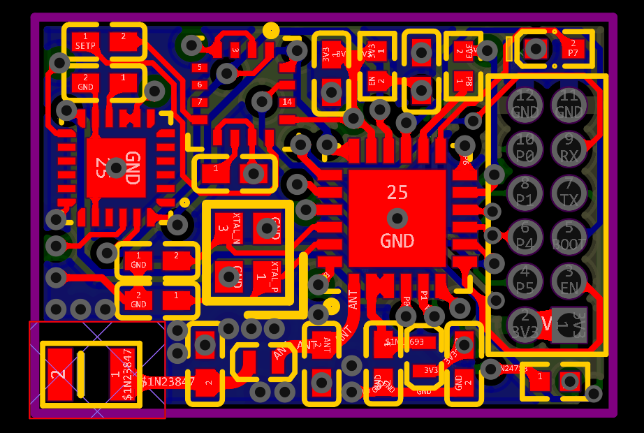
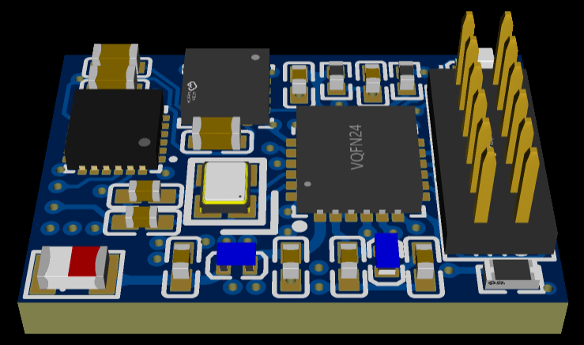
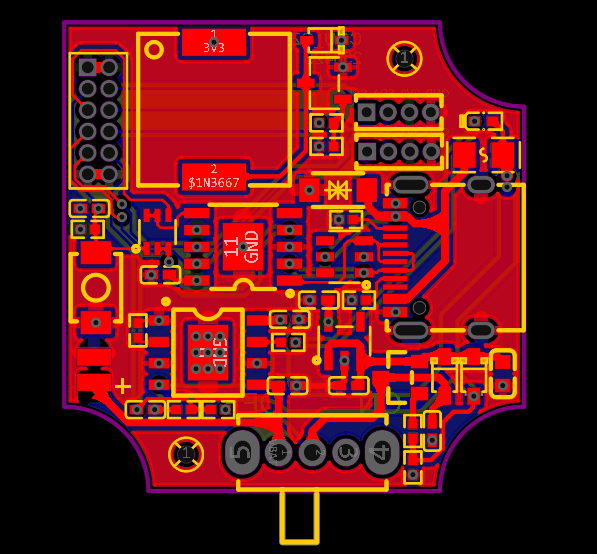
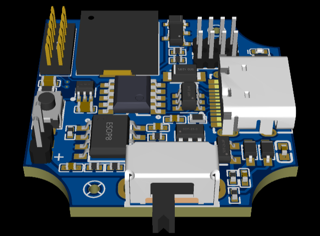
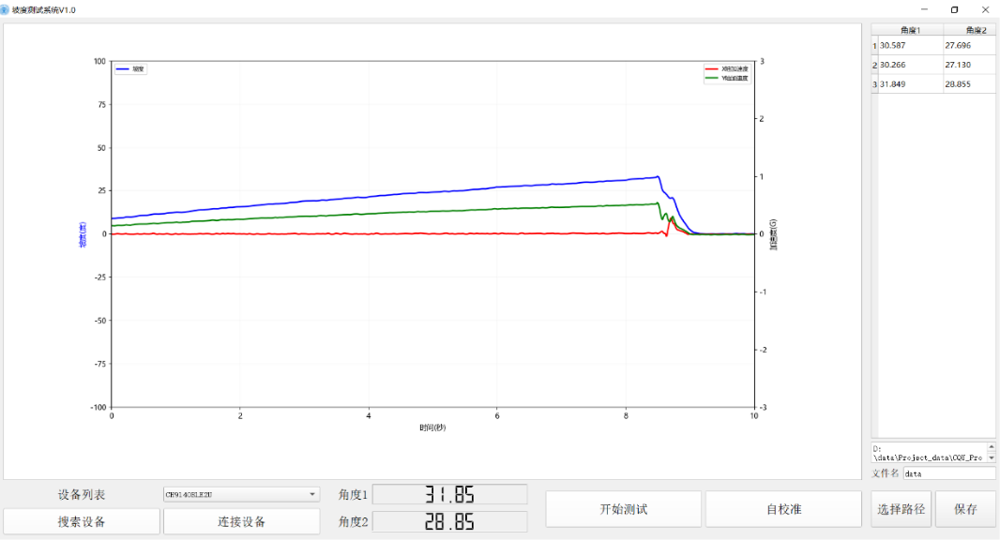

# Fabric_imu

  <strong>中文</strong> | <a href="readme.zh.md">English</a>

    

针对布料柔顺度量化难题，设计了一套基于九轴IMU的便携式测量系统。独立完成从电路设计、外壳建模、嵌入式编程到上位机数据处理软件的全流程开发。

## 演示

[测量过程简单演示](assets/demo.mp4)：

https://github.com/user-attachments/assets/e533ca0e-1a5b-42d1-a838-940a8997ca75

## 硬件设计

### 控制电路

主控采用 **ESP32C2** 微控制器，包含控制板与扩展板两个部分以便于模块化设计。

- **控制板** — 集成MCU及九轴陀螺仪，负责解算设备姿态，并引出额外GPIO以支持扩展。

  <table>
    <tr>
      <td></td>
      <td></td>
    </tr>
    <tr>
      <td align="center">正面</td>
      <td align="center">3D 视图</td>
    </tr>
  </table>

- **扩展板** — 集成USB转串口、OLED屏幕与电池管理系统等部件，负责为控制板提供电源与额外扩展。

  <table>
    <tr>
      <td></td>
      <td></td>
    </tr>
    <tr>
      <td align="center">正面</td>
      <td align="center">3D 视图</td>
    </tr>
  </table>

## 嵌入式程序设计

整体采用FreeRTOS对多个任务进行管理，包括：SPI接口获取传感器数据并采用DCM融合算法解算出3D姿态；管理蓝牙连接逻辑并发送数据给上位机；使用I2C接口驱动屏幕显示信息；通过ADC判断当前电池电量等。

### GUI 上位机软件

基于Qt开发上位机，部署算法、显示数据波形并可处理保存数据。

    

